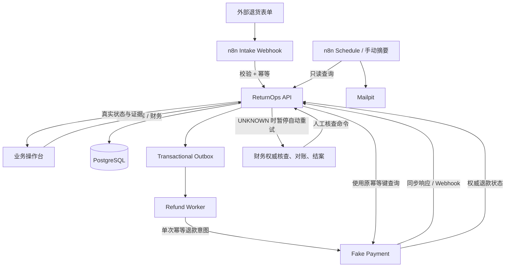
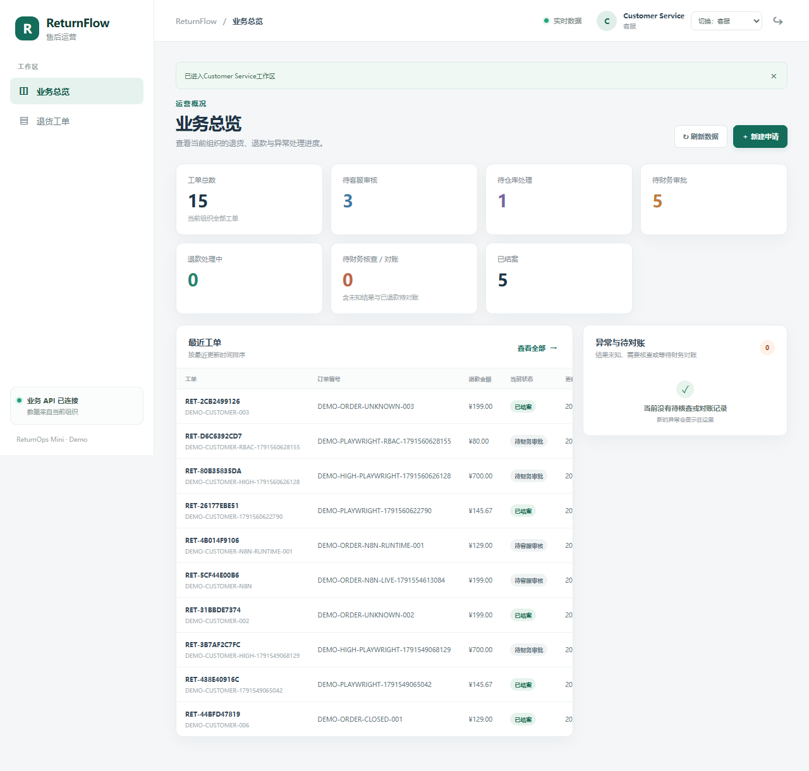

# ReturnFlow — 电商售后退款工作流

ReturnFlow 面向需要客服、仓库和财务协作的小型电商团队，将退货申请、验货、退款审批、退款执行与支付对账放进一条可追踪流程。ReturnOps API 负责业务事实和退款状态；n8n 负责外围接单与通知，不直接改库、不审批、不发起退款。

## 业务流程



## 操作台截图



正常闭环：[工单详情与支付证据](docs/assets/returnflow-closed-case.png) · 高额退款：[第二人审批](docs/assets/returnflow-second-approver.png)。

## 自动化工作流

仓库包含两份可导入的 n8n JSON：

- [`01-return-intake.json`](n8n/workflows/01-return-intake.json)：Basic Auth Webhook → 字段校验/映射 → 稳定 `Idempotency-Key` → `POST /v1/returns` → 明确返回创建、重放、冲突或拒绝结果。
- [`02-operations-digest.json`](n8n/workflows/02-operations-digest.json)：每日 09:00（`Asia/Shanghai`）或手动运行 → 查询 ReturnOps 当前汇总与角色待办 → 邮件发送到 Mailpit。摘要包含待处理工单、负责角色和下一步动作。

两条工作流已在本地 n8n 2.42.5 实例导入、绑定凭据并发布；真实生产 Webhook、幂等重放、冲突/无效/未授权路径以及摘要邮件均已执行验证。n8n 只调用 ReturnOps API；导出 JSON 不含凭据。详见 [`n8n/README.md`](n8n/README.md) 与 [测试证据](docs/TEST-EVIDENCE.md)。

## 正常流程与异常恢复

- **正常流程：**客服创建并审核 → 仓库收货/验货 → 财务审批（高额退款由不同财务人员完成双人审批）→ Fake Payment → 对账与结案。
- **异常流程：**Fake Payment 已保存退款但同步 ACK 延迟超时且无 Webhook；状态进入 `REFUND_UNKNOWN`，不盲目重试。财务查询支付方权威记录、核对证据后再对账结案。截图：[UNKNOWN 安全暂停](docs/assets/returnflow-unknown-before-reconcile.png) · [权威查询恢复](docs/assets/returnflow-unknown-recovered.png)。
- **重复/错误接单验收：**本地启动并配置 n8n 后，可运行以下集成检查；它只访问 loopback，重跑时复用固定合成事件，不会再创建同事件工单。

  ```powershell
  cd frontend
  $env:RUN_N8N_INTEGRATION = '1'
  npm run test:n8n
  Remove-Item Env:RUN_N8N_INTEGRATION
  ```

可重复演示步骤见 [`docs/DEMO.md`](docs/DEMO.md)，录屏顺序见 [`docs/RECORDING.md`](docs/RECORDING.md)。

## 技术栈

React、TypeScript、Vite · FastAPI · PostgreSQL · SQLAlchemy/Alembic · Python Outbox Worker · n8n 2.42.5 · Fake Payment · Mailpit · Docker Compose · Playwright。

## 一键启动（Windows PowerShell 7）

前置条件：Docker Desktop 已启动并使用 Linux containers。

```powershell
.\scripts\start-demo.ps1
```

首次启动从 `.env.example` 生成被忽略的 `.env` 与随机本地密钥，然后构建/启动 Compose 服务、等待 API 健康并运行可重复种子。脚本不会显示密钥。

| 服务 | 默认地址 | 用途 |
|---|---|---|
| ReturnFlow 操作台 | <http://127.0.0.1:4173> | 演示登录与售后工单处理 |
| ReturnOps API | <http://127.0.0.1:8000/docs> | OpenAPI 文档；业务状态仍由 API 管理 |
| Fake Payment | <http://127.0.0.1:8090> | 本地模拟支付方 |
| n8n | <http://127.0.0.1:5678> | 本地自动化编辑器 |
| Mailpit | <http://127.0.0.1:8025> | 查看摘要邮件 |

所有宿主机端口绑定 `127.0.0.1`。新建 n8n 数据卷时运行 `.\scripts\bootstrap-n8n-demo.ps1`，owner 与 Webhook Basic Auth 凭据只保存于忽略的 `.local/`。再在 n8n UI 导入两份 JSON，绑定本地 `Custom Auth`、Webhook 与 Mailpit SMTP 凭据并发布。凭据绑定步骤见 [`n8n/README.md`](n8n/README.md)；当前运行卷已完成初始化。

演示账户和订单均为虚构样本。角色通过服务端 Demo Mode 与 HttpOnly Cookie 切换；Demo Mode 不是生产级身份认证。停止服务保留数据；只有在明确要清空本项目演示卷时才执行带确认的重置脚本：

```powershell
.\scripts\verify-demo.ps1
.\scripts\stop-demo.ps1
.\scripts\reset-demo.ps1  # 破坏性：需输入 RESET-RETURNFLOW
```

## 主要代码模块

- `frontend/src/`：中文 React 操作台、API 类型、金额最小单位转换和会话状态。
- `src/returnops/api/routes.py`：鉴权、租户范围 API、演示会话和业务操作入口。
- `src/returnops/services/operator_queries.py`：总览、角色待办、退款异常与详情视图。
- `src/returnops/domain/states.py`、`services/returns.py`、`services/payments.py`、`services/worker.py`、`services/webhooks.py`、`services/reconciliation.py`：状态机、权限、幂等、Outbox、外部证据和 UNKNOWN 恢复。
- `src/fake_payment/`：可重复的本地支付模拟与故障场景。
- `n8n/workflows/`：两份可导入工作流；`scripts/`：启动、种子、验证、停止、重置及 UNKNOWN 演示脚本。

## 测试与证据

```powershell
.\scripts\verify.ps1                 # Ruff、mypy、非 PostgreSQL 单元/API 测试
.\scripts\verify-demo.ps1            # 本地 Compose 服务与 HTTP 页面检查
cd frontend
npm ci
npm run build
npm run lint
npm run e2e:typecheck
npm run test:e2e
```

PostgreSQL 并发/时序测试需设置 `RETURNOPS_TEST_DATABASE_URL` 后执行 `.\scripts\verify.ps1 -Integration`。本次证据包括 49 项 Python 测试通过、Playwright 正常/异常流程、PostgreSQL integration tests、n8n 生产 Webhook 幂等与拒绝路径、一次真实的 09:00 Asia/Shanghai 计划触发并成功投递到 Mailpit。逐项结果及环境边界见 [`docs/TEST-EVIDENCE.md`](docs/TEST-EVIDENCE.md)。

## 已知限制

- Fake Payment 与 Mailpit 仅用于本地演示；未接入真实支付、外部 SMTP 或生产 ERP，也不处理真实客户个人信息。
- 邮件投递采用普通 SMTP：执行重试可能产生重复摘要，SMTP 超时也不代表 Mailpit 未收信；不宣称 exactly-once。每日计划已在 2026-10-10 09:00（Asia/Shanghai）观察到一次成功执行；单次观测不代表长期调度可靠性。
- Playwright 与 n8n runtime 测试会在持久化演示库留下合成工单；它们不是客户数据。`reset-demo.ps1` 会清空本项目命名卷且不可逆，必须手动确认。
- 没有真实企业采用率、节省工时或差错率的测量；这些效果尚未验证。

## 项目材料

- [架构与安全边界](docs/ARCHITECTURE.md) · [演示步骤](docs/DEMO.md) · [作品集案例](docs/PORTFOLIO.md)
- [录屏脚本](docs/RECORDING.md) · [测试证据](docs/TEST-EVIDENCE.md) · [初始仓库基线](docs/BASELINE.md)
- [Mailpit 摘要收件箱](docs/assets/mailpit-summary-inbox.png) · [n8n Intake 节点图](docs/assets/n8n-01-return-intake.png) · [n8n Digest 节点图](docs/assets/n8n-02-operations-digest.png) · [n8n 定时摘要成功执行](docs/assets/n8n-02-scheduled-execution.png)
