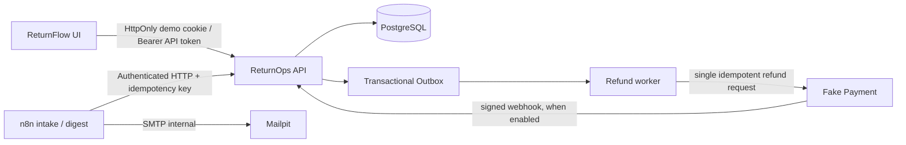

# ReturnFlow 架构与安全边界

## 组件



Compose 默认端口为 Frontend `4173`、API `8000`、Fake Payment `8090`、n8n `5678` 和 Mailpit Web `8025`；全部映射到 `127.0.0.1`。服务之间使用 Compose 网络名 `api`、`payment`、`mailpit`，而不是宿主机回环地址。

## 业务事实由 API 拥有

```text
REQUESTED ──客服──> AUTHORIZED ──仓库──> RECEIVED ──仓库验货──> INSPECTED
    │                                                        │
    └──客服拒绝──> REJECTED                                 └──财务审批──> REFUND_PENDING
                                                                     │
                                       REFUND_UNKNOWN <──超时──┤    │
                      财务查询 Fake Payment ────────────────┘    └──成功──> REFUNDED
                                                                              │
                                                             财务对账──> RECONCILED ──> CLOSED
```

高额退款按 `RETURNOPS_HIGH_VALUE_THRESHOLD` 执行四眼审批：第一笔审批留下独立记录，工单仍保持 `INSPECTED`；第二笔审批必须来自不同用户且金额相同，随后才会创建退款意图。服务端状态机、角色、租户与版本检查是最终门禁，前端 `allowedActions` 只负责隐藏当前身份不能执行的动作。

## 幂等与退款可靠性

- 写入操作与审计事件在同一数据库事务中提交；退款意图和 `refund.dispatch` Outbox 事件在审批事务中一并创建。
- Worker 先租约式 claim Outbox 事件，再用稳定 provider idempotency key 派发。超时不会被当作失败并重发；本地状态进入 `REFUND_UNKNOWN`，派发次数不会因自动重试增加。
- 同步 provider 响应和 Webhook 都能确认支付事实。更新按退款意图、provider reference 与证据进行幂等去重。
- 未知结果处理先对 Fake Payment 做按幂等键查询：已成功则补齐权威证据并转 `REFUNDED`；确认为不存在时才开放受控恢复操作。财务随后单独执行对账和结案。
- Fake Payment 的模拟模式由后端配置或受限的一次性 Demo 命令决定；ReturnFlow 的客户 API 不接收可任意指定故障的参数。

## 身份、组织与数据

- 每个请求根据有效成员关系解析 `organization_id` 和角色；所有查询、幂等键、事件、退款意图及审计行都带组织范围。
- 浏览器默认使用服务端创建的短期 HttpOnly Cookie；用户明确切换 API Token 模式时，客户端仅在当前内存中持有 token。前端不把长期 bearer token 写入 `localStorage` 或 `sessionStorage`。
- 演示账户和样例使用 `example.test` 邮箱、合成订单号与客户引用编号。`seed-demo.ps1` 可重复运行，不输出原始 service token；自动化凭证保存在被忽略的 `.local/` 文件。
- n8n 仅调用 ReturnOps HTTP API。工作流 JSON 不含 bearer token、组织秘密、数据库节点或 Fake Payment 写入节点。摘要邮件通过内部 SMTP 送入 Mailpit。
- `/v1/overview` 的 `attentionItems` 由当前工单状态映射到客服、仓库或财务，并给出下一步动作；状态计数、异常及待对账工单全部来自当前组织的 PostgreSQL 记录。已成功退款但尚未对账的 `REFUNDED` 工单仍保留在财务异常/对账中心，直到进入 `RECONCILED`。

## n8n 初始化与运行边界

1. 人工只需触发 `scripts/start-demo.ps1`；它负责 Compose、Seed、owner 初始化、本地凭据生成、工作流 upsert、绑定和发布。首次缺少 Playwright 工具链时会按锁文件安装依赖和 Chromium。
2. 自动化脚本使用仅存于 Git 忽略 `.local/` 的 90 天 n8n bootstrap API key，通过 n8n public REST API 管理本地凭据/工作流；key 不会被写入工作流 JSON。若续期或中途失败，重复运行会验证并恢复现状，不删除卷。
3. ReturnOps 工作流凭据只引用权限受限的 automation 用户；该用户能建单、读待办，不能审批退款、触发支付或对账。Webhook Basic Auth 和 Mailpit SMTP 凭据同样仅保存在本地 n8n 加密数据卷。
4. Daily Schedule Trigger 使用 Compose 的 `GENERIC_TIMEZONE`（默认 `Asia/Shanghai`）；手动 Digest 和一次真实 09:00 定时 Digest 均通过 Mailpit 验证。所有服务只绑定 loopback；Fake Payment 与 Mailpit 不会触达真实支付或外发邮件。

当前本地 n8n 2.42.5 的运行证据、自动启动干净环境复现和边界记录见 [`TEST-EVIDENCE.md`](TEST-EVIDENCE.md)。
